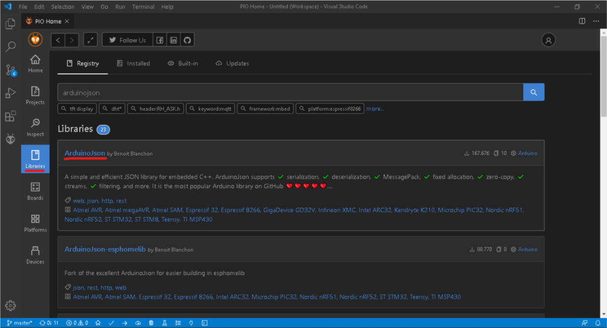

# Cemco-sirio

# Construido con
    * [Visual Studio Code](https://code.visualstudio.com/) - El editor de codigo usado.
    * [PlatformIO](https://platformio.org/) - Extensión para sistemas embebidos. 
# librerias
    En el desarrollo del proyecto se implementaron liberías de terceros para la comunicación con los periféricos. 
    * [Wiegand](https://github.com/monkeyboard/Wiegand-Protocol-Library-for-Arduino) - Libería del protocolo usado para comincarse con el keypad.
    * [EDB](https://github.com/jwhiddon/EDB) - Libería para gestionar las base de datos de forma local en el arduino.
    * [VC0706 Serial camera](https://github.com/adafruit/Adafruit-VC0706-Serial-Camera-Library) - Libería para comunicarse con la camara serial.
    * [ArduinoJson](https://github.com/bblanchon/ArduinoJson) - Libería para procesar json de los request.
    * [Ethernet](https://github.com/arduino-libraries/Ethernet) - Libería del shield de ethernet.
    Para la instalación de las liberías se puede dirigir al gestor de liberías de platformio y buscar cada una de las liberías.
    
    Otra opción para instalar las liberías en windows es descargar el código source y moverlo a la ubicación en disco:
    ```
    C:\Users\<YourUserName>\.platformio\packages\framework-arduino-avr\libraries
    ``` 